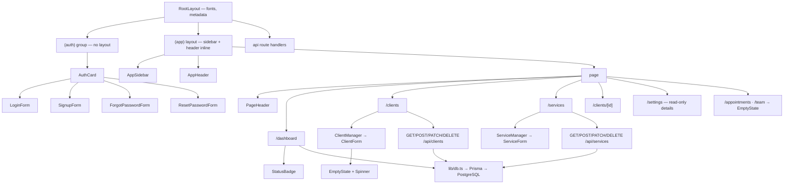

# GlowBook — Component Architecture

**Status:** agreed in the Week 03 team meeting · **Last updated:** 2026-09-29

**Companion docs:** [`data-model.md`](./data-model.md) · [`design-system.md`](./design-system.md) · [`glowbook-spec.md`](./glowbook-spec.md)

This document records the route and component structure the team agreed on before any feature work started, so that parallel branches produce code that fits together.

**How to read it:** every section splits what **exists today** from what is **still planned**. The planned items are Week 04 work, not claims about the current codebase. Counts in the "built" tables were counted from the source, not estimated.

---

## 1. Principles

1. **Server components by default.** A component is a client component only when it needs state, effects, event handlers, or a browser API.
2. **Initial data comes from the server.** Server components read the database and pass the result down as props. Client components re-fetch through a route handler *only after a mutation the user just performed* — never to populate themselves on mount.
3. **One feature, one folder.** Everything specific to a domain (services, clients, appointments, dashboard) lives under `src/components/features/<domain>/`. Anything used by three or more routes is promoted to `src/components/ui/` or `src/components/layout/`.
4. **No cross-feature imports.** `features/appointments/` may import from `ui/` and `lib/`, never from `features/clients/`. Shared appointment+client pieces go into `components/shared/`.
5. **Tenancy is never a client concern.** `accountId` is read from the session in the server layer, never taken from a request body, a query string, or a route parameter.

Next.js 16 specifics we follow: request interception lives in `src/proxy.ts` (Next 16 renamed `middleware.ts` → `proxy.ts`), and `params` / `searchParams` are Promises that must be awaited.

---

## 2. Routes

### Route groups

| Group | Purpose | Layout | Auth |
|---|---|---|---|
| `(auth)` | Sign-up, sign-in, password reset | No group layout — each page centres its own `AuthCard` | Public |
| `(app)` | Everything a signed-in user sees | `src/app/(app)/layout.tsx` renders `AppSidebar` + `AppHeader` inline | Required |

The `(auth)` group has no `layout.tsx`. The centring lives in the `AuthCard` wrapper instead, which is why all four pages repeat the same two wrapper elements.

### Built — 17 routes (12 pages + 5 route handlers)

| Route | Purpose | State |
|---|---|---|
| `/` | Redirects to `/dashboard` | Built |
| `/login` · `/signup` | Session lifecycle | Built |
| `/forgot-password` · `/reset-password` | Password recovery | Built |
| `/dashboard` | Four metrics + the next five appointments | Built |
| `/clients` · `/clients/[id]` | Client list, profile, history | Built |
| `/services` | Service catalog list | Built |
| `/settings` | Read-only studio details, timezone, currency | Built — read-only, editing is the next milestone |
| `/team` | Staff and invitations | Placeholder — `EmptyState` only |
| `/appointments` | — | Placeholder — `EmptyState` only |
| `GET/POST /api/clients` | Client list, create | Built |
| `PATCH/DELETE /api/clients/[id]` | Edit, archive-or-delete | Built |
| `GET/POST /api/services` | Service list, create | Built |
| `PATCH/DELETE /api/services/[id]` | Edit, archive-or-delete | Built |
| `POST /api/auth/[...nextauth]` | Auth.js credentials handler | Built |

`/appointments` and `/team` render an explicit "not built yet" `EmptyState` rather than a broken page. `/settings` is a working read-only page, not a placeholder — it shows the studio's name, timezone and currency but does not save changes yet.

### Planned — not yet built

| Route | Purpose | Priority |
|---|---|---|
| `/calendar` | Day/week schedule with filters by status and staff (US4) | **P1** |
| `/appointments/new` | Book an appointment: client, services, date, time (US4) | **P1** |
| `/appointments/[id]` | Appointment detail, edit, cancel, status change (US4) | **P1** |
| `/clients/new` · `/clients/[id]/edit` | Create and edit a client (US3) | **P1** |
| `/services/new` · `/services/[id]/edit` | Create and edit a service (US2) | **P1** |
| `/settings/staff` | Owner-only: invite staff, list pending invitations (US1) | P2 |
| `/settings/profile` | Studio name, owner email and password | P2 |
| `GET/POST /api/appointments` · `PATCH/DELETE /api/appointments/[id]` | Appointment CRUD | **P1** |
| `PATCH /api/appointments/[id]/status` | Status transitions | **P1** |
| `GET/POST /api/staff/invitations` | Staff invites (owner only) | P2 |

Client and service create/edit currently happen in a dialog on the list route rather than at their own URL, so those planned paths are a routing decision still open, not a gap.

**Deviations from the original plan, and why:**

- The original table listed `GET` and `PUT` on `/api/clients/[id]` and `/api/services/[id]`. The built handlers expose `PATCH` and `DELETE` only — there is no `GET` for a single record and no `PUT`. `PATCH` was chosen because the handlers merge a partial payload.
- `POST /api/auth/*` route handlers were **not** built. Sign-up, sign-in, sign-out and password reset are Auth.js server actions in `src/lib/auth/actions.ts`, not HTTP routes. The Auth.js handler at `/api/auth/[...nextauth]` is the only auth route.
- The planned `GET /api/hello` health check and `GET /api/dashboard/today` were dropped as unnecessary: the dashboard reads Prisma directly in its server component, so a second endpoint would only duplicate it.

The full method/endpoint table with auth requirements is in the [README](../README.md#api-documentation).

---

## 3. Component inventory

### Layout — `src/components/layout/` (3 built)

| Component | Used on | Notes |
|---|---|---|
| `AppSidebar` | every `(app)` route | Nav links, active state, studio name |
| `AppHeader` | every `(app)` route | Mobile nav strip, user menu, sign out |
| `AuthCard` | all four `(auth)` routes | Centred card wrapper for the auth forms |

`PageHeader` is **not** here — it lives in `shared/` because it is not layout chrome.

There is no `AppShell` component. The sidebar/header/content shell is written inline in `src/app/(app)/layout.tsx`, which is why this table is shorter than planned.

### Shared — `src/components/shared/` (7 built)

| Component | Used on | Notes |
|---|---|---|
| `EmptyState` | clients, services, appointments, team, dashboard | Icon, message, optional CTA — required by constitution §IV |
| `StatusBadge` | dashboard, client profile | Maps appointment status to its design token |
| `ConfirmDialog` | services, clients | Reusable archive/delete confirmation |
| `FormField` | every form | Label, description, error message, `aria-*` wiring |
| `SubmitButton` | the four auth forms | Shows pending state, disables double submit |
| `PageHeader` | every `(app)` route | Title, description, action slot |
| `Spinner` | clients, services, lists | Pending affordance |

`PageSkeleton`, `ErrorState` and `DataTable` are **not** built. The client and service lists are cards inside a manager component, not a generic table, so `DataTable` is unlikely to earn its keep; the other two are only worth adding alongside the first `loading.tsx` / `error.tsx`.

### Features — `src/components/features/` (8 built)

| Domain | Built | Planned |
|---|---|---|
| `auth/` | `LoginForm`, `SignupForm`, `ForgotPasswordForm`, `ResetPasswordForm` | — |
| `clients/` | `ClientManager`, `ClientForm` | `NotesEditor`, `ClientHistory` |
| `services/` | `ServiceManager`, `ServiceForm` | `ServicePicker` |
| `dashboard/` | — | `TodayList`, `UpcomingPreview`, `QuickStats` |
| `calendar/` | — | `CalendarView`, `DayColumn`, `AppointmentBlock`, `CalendarFilters`, `BookingForm` |
| `staff/` | — | `StaffList`, `InviteStaffForm`, `InvitationStatus` |

The dashboard currently reads Prisma inside its own server component and renders markup directly; the three planned dashboard components are the refactor, not missing pieces of existing work.

### UI primitives — `src/components/ui/` (4 built)

`button`, `input` (which also exports the `Textarea` variant), `label`, `card`.

These follow shadcn/ui conventions — `cn()`, `cva` variants, `data-slot` attributes, and the same Radix primitives — but they are **hand-built, not copied from the shadcn CLI**. `button` uses `primary`/`danger` variants where shadcn uses `default`/`destructive`, and the colour scale is the project's own warm palette rather than a shadcn base colour. [`components.json`](../components.json) exists so that future `shadcn add` runs land in the right place with the right aliases; it is not evidence about how these four were written.

### Count

**22 components built — 3 layout, 7 shared, 8 feature, 4 UI.** Eight of them (`EmptyState`, `StatusBadge`, `ConfirmDialog`, `FormField`, `SubmitButton`, `PageHeader`, `Spinner`, `AuthCard`) are imported by two or more files, which satisfies the "at least 5 components used across multiple pages" requirement. The original plan of ~40 was never wrong as a plan; it was wrong to present it as current state.

---

## 4. Component hierarchy



---

## 5. Data fetching pattern

Server components read Prisma and pass results down; client components re-fetch only after a mutation. The shape a teammate can rely on:

```ts
// Server component — reads the database, passes rows down
export default async function ClientsPage() {
  const user = await requireUser();
  const clients = await db.client.findMany({
    where: { accountId: user.accountId, isArchived: false },
    orderBy: [{ lastName: "asc" }, { firstName: "asc" }],
  });
  return <ClientManager initialClients={clients} />;
}
```

```ts
// Client component — owns interactivity, re-reads only after a mutation
const [clients, setClients] = useState(initialClients);

async function reload() {
  const result = await apiFetch<{ data: ClientWithCount[] }>("/api/clients");
  setClients(result.data);
}

async function handleArchive(client: ClientWithCount) {
  await apiFetch(`/api/clients/${client.id}`, { method: "DELETE" });
  await reload();
}
```

Three things to know about this, because they differ from the original plan:

- **Prisma is imported directly in server components.** There is no `src/lib/queries/` layer. The single shared Prisma client is `src/lib/db.ts`; queries are written inline next to the page that needs them. A `lib/queries/` layer is still worth adding once the appointment queries need shared overlap logic.
- **`revalidatePath()` is not used.** Mutations are followed by a client-side re-read through `apiFetch`, so the server component's first render is the only one. This is why the list pages fetch twice in total across a session rather than once per render.
- **There is no client-side data-fetching library.** One `apiFetch` helper in `src/lib/utils/api-client.ts` wraps every call.

---

## 6. Week 04 priority ranking

| Rank | Work | Owner | Status | Why first |
|---|---|---|---|---|
| 1 | Prisma schema + migrations + seed | Aaron | Done | Every feature depends on the data layer |
| 2 | Auth.js credentials flow, session, `proxy.ts` guard | Aaron | Done | Multi-tenant isolation proven before any data is exposed |
| 3 | Design tokens + shared chrome | Iván | Done | Sidebar, header and form primitives unblocked parallel work |
| 4 | Service catalog CRUD end to end | Iván | Done | Smallest complete vertical slice |
| 5 | Client profiles CRUD + notes | Iván | Done | Second data model; satisfies the two-model CRUD requirement |
| 6 | Dashboard | Iván | Done | Depends on 4 and 5 |
| 7 | Appointments: booking, overlap detection, status | Both | **Next** | Core value; depends on 4 and 5 |
| 8 | Calendar and staff invitations | Both | Planned | Depends on 7 |

**Definition of done for every issue:** feature branch → PR → one approving review from the other team member → `npm run typecheck`, `npm run lint`, `npm run format:check` and `npm run build` pass (all four run in CI) → the issue's acceptance scenarios from [`glowbook-spec.md`](./glowbook-spec.md) are demonstrable.
