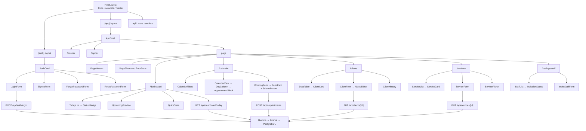

# GlowBook — Component Architecture

**Status:** agreed in the Week 03 team meeting · **Last updated:** 2026-09-24
**Companion docs:** [`data-model.md`](./data-model.md) · [`design-system.md`](./design-system.md) · [`glowbook-spec.md`](./glowbook-spec.md)

This document records the route and component structure the team agreed on before any feature work started, so that parallel branches produce code that fits together.

---

## 1. Principles

1. **Server components by default.** A component is a client component only when it needs state, effects, event handlers, or a browser API. Fetching happens in server components and route handlers, never inside client components.
2. **One feature, one folder.** Everything specific to a domain (services, clients, appointments, dashboard) lives under `src/components/features/<domain>/`. Anything used by three or more routes is promoted to `src/components/ui/` or `src/components/layout/`.
3. **No cross-feature imports.** `features/appointments/` may import from `ui/` and `lib/`, never from `features/clients/`. Shared appointment+client pieces go into `components/shared/`.
4. **Data flow is one way.** Route handler → Prisma → JSON → server component props → client component state. Never the reverse.

---

## 2. Routes

### Route groups

Two groups keep the auth boundary in one place instead of scattering checks across pages.

| Group | Purpose | Layout | Auth |
|---|---|---|---|
| `(auth)` | Sign-up, sign-in, password reset | Centered card on a branded background | Public |
| `(app)` | Everything a signed-in user sees | `AppShell` (sidebar + topbar) | Required |

Next.js 16 specifics we are following: request interception lives in `src/proxy.ts` (Next 16 renamed `middleware.ts` → `proxy.ts`), `params` and `searchParams` are Promises and must be awaited, and the generated `LayoutProps<"/">` / `PageProps<"/route">` global types replace hand-written prop interfaces.

### Public routes

| Route | Purpose | Priority |
|---|---|---|
| `/` | Landing page: what GlowBook is, CTA to sign up. Redirects signed-in users to `/dashboard` | P2 |
| `/login` | Sign in | **P1** |
| `/signup` | Create a studio account | **P1** |
| `/forgot-password` | Request a reset link | P1 |
| `/reset-password?token=…` | Set a new password from the emailed link | P1 |

### Authenticated routes — `(app)`

| Route | Purpose | Priority |
|---|---|---|
| `/dashboard` | Today's appointments in chronological order + upcoming preview (US5) | **P1** |
| `/calendar` | Day/week schedule with filters by status and staff (US4) | **P1** |
| `/appointments/new` | Book an appointment: client, services, date, time (US4) | **P1** |
| `/appointments/[id]` | Appointment detail, edit, cancel, status change (US4) | **P1** |
| `/clients` | Client list with search (US3) | **P1** |
| `/clients/new` | Create a client (US3) | **P1** |
| `/clients/[id]` | Client profile: contact info, notes, appointment history (US3) | **P1** |
| `/clients/[id]/edit` | Edit a client and their notes (US3) | **P1** |
| `/services` | Service catalog list (US2) | **P1** |
| `/services/new` | Create a service (US2) | **P1** |
| `/services/[id]/edit` | Edit a service (US2) | **P1** |
| `/settings/staff` | Owner-only: invite staff, list pending invitations (US1) | P2 |
| `/settings/profile` | Studio name, owner email and password | P2 |

### API route handlers — `src/app/api`

| Route | Purpose |
|---|---|
| `GET /api/hello` | Health check; proves the client → server → response cycle |
| `POST /api/auth/register` · `login` · `logout` | Session lifecycle (Auth.js credentials) |
| `POST /api/auth/password-reset` · `password-reset/[token]` | Password recovery |
| `GET/POST /api/staff/invitations` | Staff invites (owner only) |
| `GET/POST /api/services` · `GET/PUT/DELETE /api/services/[id]` | Service CRUD |
| `GET/POST /api/clients` · `GET/PUT/DELETE /api/clients/[id]` | Client CRUD |
| `GET/POST /api/appointments` · `GET/PUT/DELETE /api/appointments/[id]` | Appointment CRUD |
| `PATCH /api/appointments/[id]/status` | Status transitions |
| `GET /api/dashboard/today` | Dashboard payload |

The full method/endpoint table with auth requirements is in the [README](../README.md#api-documentation).

---

## 3. Component inventory

### Layout — `src/components/layout/`

| Component | Used on | Notes |
|---|---|---|
| `AppShell` | all `(app)` routes | Sidebar + topbar + scrollable content area |
| `Sidebar` | all `(app)` routes | Nav links, active state, studio name |
| `Topbar` | all `(app)` routes | Page title slot, user menu, sign out |
| `PageHeader` | all `(app)` routes | Title, description, primary action slot |
| `AuthCard` | all `(auth)` routes | Centered card wrapper for auth forms |

### Shared — `src/components/shared/`

| Component | Used on | Notes |
|---|---|---|
| `EmptyState` | clients, services, calendar, dashboard | Icon, message, optional CTA — required by constitution §IV |
| `StatusBadge` | appointments, calendar, dashboard | Maps appointment status to its design token |
| `ConfirmDialog` | services, clients, appointments | Reusable delete/cancel confirmation |
| `FormField` | every form | Label, description, error message, `aria-*` wiring |
| `SubmitButton` | every form | Shows pending state, disables double submit |
| `PageSkeleton` | every `(app)` list route | Loading state for server component Suspense |
| `ErrorState` | every `(app)` route | Renders a route error boundary failure with a retry |
| `DataTable` | clients, services, staff | Column config, sorting, pagination, mobile card fallback |

### Features — `src/components/features/`

| Domain | Components |
|---|---|
| `auth/` | `LoginForm`, `SignupForm`, `ForgotPasswordForm`, `ResetPasswordForm` |
| `dashboard/` | `TodayList`, `UpcomingPreview`, `QuickStats` |
| `calendar/` | `CalendarView`, `DayColumn`, `AppointmentBlock`, `CalendarFilters`, `BookingForm` |
| `clients/` | `ClientList`, `ClientCard`, `ClientForm`, `NotesEditor`, `ClientHistory` |
| `services/` | `ServiceList`, `ServiceCard`, `ServiceForm`, `ServicePicker` |
| `staff/` | `StaffList`, `InviteStaffForm`, `InvitationStatus` |

### UI primitives — `src/components/ui/`

shadcn/ui components, unmodified where possible: `button`, `input`, `label`, `textarea`, `select`, `dialog`, `dropdown-menu`, `table`, `badge`, `card`, `calendar`, `popover`, `toast`/`sonner`, `skeleton`, `alert-dialog`, `form`.

**Count: 8 layout/shared components + ~19 feature components + 14 UI primitives planned. As of the W03 submission 22 are built — 3 layout, 7 shared, 8 feature, 4 UI — of which 11 are used across two or more pages, already over the "at least 5 components used across multiple pages" requirement.**

---

## 4. Component hierarchy



---

## 5. Data fetching pattern

Every list and detail page follows the same three steps, so a teammate picking up any issue already knows the shape:

```ts
// 1. lib/queries/clients.ts — all Prisma access lives in lib, never in components
export async function getClients(studioId: string) {
  return db.client.findMany({ where: { studioId }, orderBy: { name: "asc" } });
}

// 2. Server component — fetch and pass down
export default async function ClientsPage() {
  const session = await auth();
  const clients = await getClients(session.user.studioId);
  return <DataTable rows={clients} />;   // 3. client component owns interactivity only
}
```

- Mutations go through a route handler, then `revalidatePath()` so the server component re-renders.
- No client-side data fetching library. Server components + route handlers only.

---

## 6. Week 04 priority ranking

| Rank | Work | Owner | Why first |
|---|---|---|---|
| 1 | Prisma schema + migrations + seed | Aaron | Every feature depends on the data layer; unblocks the rest |
| 2 | Auth.js credentials flow, session, `proxy.ts` guard, `(auth)` + `(app)` shells | Aaron | Multi-tenant isolation must be proven before any data is exposed |
| 3 | Design tokens + shadcn/ui setup + `AppShell` | Iván | Shared chrome lets both members build in parallel afterwards |
| 4 | Service catalog CRUD end to end | Iván | Smallest complete vertical slice; proves the client → server → DB cycle |
| 5 | Client profiles CRUD + notes | Iván | Second data model; satisfies the two-model CRUD requirement |
| 6 | Appointments: booking, overlap detection, status | Both | Core value; depends on 4 and 5 |
| 7 | Dashboard + calendar views | Both | Depends on 6 |
| 8 | Staff invitations (owner only) | Aaron | Lowest value for the demo; Phase 2 candidate |

**Definition of done for every issue:** feature branch → PR → one approving review → `npm run lint` and `npm run build` pass → the issue's acceptance scenarios from [`glowbook-spec.md`](./glowbook-spec.md) are demonstrable on the deployed preview.
