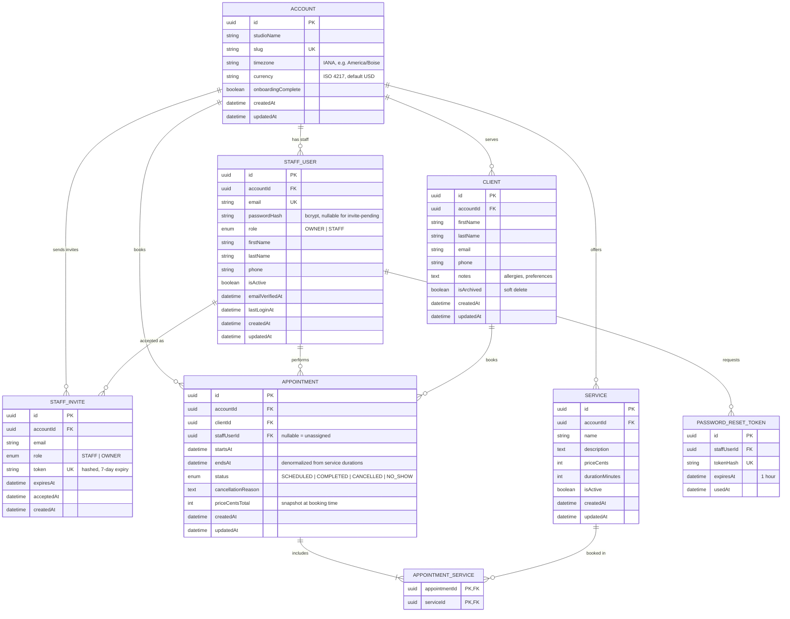

# GlowBook — Data Model

**Status:** agreed in the Week 03 team meeting · **Last updated:** 2026-09-24
**Companion docs:** [`architecture.md`](./architecture.md) · [`design-system.md`](./design-system.md) · [`glowbook-spec.md`](./glowbook-spec.md)

---

## 1. Database decision

| Decision | Choice | Rationale |
|---|---|---|
| Database | **PostgreSQL on Supabase** (managed, free tier) | Explicitly approved by the course. Relational integrity matters here: an appointment must always point at a real client, a real service, and a real studio. Supabase gives us a hosted Postgres, a connection pooler that survives Vercel's serverless model, and a GUI for inspecting data |
| ORM | **Prisma 7.10** | Typed client generated from one schema file, migrations checked into the repo, and `prisma studio` for verifying seed data. Keeps every query type-checked under `strict` TypeScript. On v7 the datasource block carries no `url` and the connection string, migrations path, and seed command live in `prisma7.config.ts` |
| Auth | **Auth.js v5, Credentials provider** | Course default. Identity lives in our own tables so the studio tenancy rules (FR-006/FR-007) are enforced in our code, not delegated to a vendor |
| IDs | **UUIDv7 via Prisma `@default(uuid())`** | Client-generatable and index-friendly; avoids sequential-ID enumeration on public endpoints |
| Money | **Integer cents (`Int`), never floats** | `priceCents` avoids the rounding errors that `Decimal`/float pricing introduces in totals |
| Time | **`DateTime`, currently `timestamp(3)` without a time zone** | Every `Account` stores its own IANA `timezone` and all appointment times are rendered through it, but the stored values are naive. The calendar filters and overlap queries need timezone-aware comparisons, so the day boundary must be computed in the studio's zone before querying — tracked as the first follow-up to Week 04, before the appointment calendar is built |

**Deployment note:** at runtime the app uses the pooled `DATABASE_URL` (Supabase pooler, port 6543, `pgbouncer=true`); `prisma migrate` uses the direct `DIRECT_URL`. Migrations are never run on Vercel at build time.

---

## 2. Entity relationship diagram



---

## 3. Entities in detail

Every table carries `createdAt` / `updatedAt` (`@updatedAt` handled by Prisma) and, except where noted, `accountId` for tenant isolation.

### 3.1 `Account` (the studio — tenancy root)

| Field | Type | Rules |
|---|---|---|
| `id` | `uuid` | PK, `uuid()` |
| `studioName` | `string(120)` | Required; set at sign-up (FR-001) |
| `slug` | `string(140)` | Required, **unique** — future public booking URL |
| `timezone` | `string(64)` | IANA name; defaults from the browser at sign-up, drives calendar rendering |
| `currency` | `string(3)` | ISO 4217, default `USD` |
| `onboardingComplete` | `boolean` | Default `false`; `true` after the first service is created |
| `createdAt` / `updatedAt` | `DateTime` | — |

**This is the isolation boundary.** Every query in `lib/queries/` filters by `accountId` taken from the session — never from user input.

### 3.2 `StaffUser`

| Field | Type | Rules |
|---|---|---|
| `id` | `uuid` | PK |
| `accountId` | `uuid` | FK → `Account.id`, `onDelete: Cascade`, indexed |
| `email` | `string(255)` | **Unique globally** — this is what enforces FR-002 (no duplicate accounts across studios) |
| `passwordHash` | `string(255)` | bcrypt, cost 12; nullable only while an invite is pending |
| `role` | `enum` | `OWNER` \| `STAFF`; first signup of an account is always `OWNER` |
| `firstName` / `lastName` | `string(80)` | Required |
| `phone` | `string(32)` | Optional |
| `isActive` | `boolean` | Default `true`; deactivating blocks sign-in without deleting history |
| `emailVerifiedAt` | `DateTime?` | Set when a password reset link is consumed |
| `lastLoginAt` | `DateTime?` | — |

### 3.3 `StaffInvite`

| Field | Type | Rules |
|---|---|---|
| `id` | `uuid` | PK |
| `accountId` | `uuid` | FK → `Account.id`, Cascade |
| `email` | `string(255)` | Indexed; no unique constraint — re-inviting after expiry is allowed |
| `role` | `enum` | Role the invitee will receive |
| `token` | `string(255)` | **Hashed** at rest, unique, single use |
| `expiresAt` | `DateTime` | `createdAt + 7 days` |
| `acceptedAt` | `DateTime?` | Null while pending; the invite list filters on this |

Backs FR-007. Accepted invites create the `StaffUser` row and set `acceptedAt` in one transaction.

### 3.4 `Client`

| Field | Type | Rules |
|---|---|---|
| `id` | `uuid` | PK |
| `accountId` | `uuid` | FK → `Account.id`, Cascade, indexed |
| `firstName` | `string(80)` | **Required** (FR-016) |
| `lastName` | `string(80)` | **Required** |
| `email` | `string(255)?` | Optional; at least one of email/phone is enforced in the Zod schema |
| `phone` | `string(32)?` | Optional |
| `notes` | `text?` | Free-form: allergies, preferences, formula references (FR-012) |
| `isArchived` | `boolean` | Default `false` — soft delete so appointment history stays intact |
| `createdAt` / `updatedAt` | `DateTime` | — |

**Delete rule (FR-015):** the UI warns first. If the client has appointments, the route handler returns `409` unless `?strategy=archive` is passed, which sets `isArchived = true` instead of deleting the row.

### 3.5 `Service`

| Field | Type | Rules |
|---|---|---|
| `id` | `uuid` | PK |
| `accountId` | `uuid` | FK → `Account.id`, Cascade, indexed |
| `name` | `string(120)` | **Required** (FR-010) |
| `description` | `text?` | Optional |
| `priceCents` | `int` | **Required**, `>= 0` |
| `durationMinutes` | `int` | **Required**, `1..600` — drives `Appointment.endsAt` |
| `isActive` | `boolean` | Default `true`; inactive services stay visible on past appointments |
| `createdAt` / `updatedAt` | `DateTime` | — |

**Delete rule (FR-009):** deleting a service referenced by any non-cancelled appointment returns `409` and lists the blocking appointments.

### 3.6 `Appointment`

| Field | Type | Rules |
|---|---|---|
| `id` | `uuid` | PK |
| `accountId` | `uuid` | FK → `Account.id`, Cascade, indexed — denormalized so overlap queries never need a join |
| `clientId` | `uuid` | FK → `Client.id`, `onDelete: Restrict` |
| `staffUserId` | `uuid?` | FK → `StaffUser.id`, `onDelete: SetNull` — null means "unassigned" |
| `startsAt` | `DateTime` | **Required** (FR-022) |
| `endsAt` | `DateTime` | **Required**; computed as `max(service durations)` from the selected services |
| `status` | `enum` | `SCHEDULED` (default, FR-024) \| `COMPLETED` \| `CANCELLED` \| `NO_SHOW` |
| `cancellationReason` | `text?` | Set when status becomes `CANCELLED` |
| `priceCentsTotal` | `int` | Snapshot of the summed service prices **at booking time**, so later price edits do not rewrite history |
| `createdAt` / `updatedAt` | `DateTime` | — |

**Overlap rule (FR-021):** on create/update, the handler loads the staff member's non-cancelled appointments for that day and returns `409` with the conflicting slot if `startsAt < other.endsAt && endsAt > other.startsAt`. A Postgres `EXCLUDE USING gist` constraint on `tstzrange(startsAt, endsAt)` is the Phase 2 hardening.

### 3.7 `AppointmentService` (join table)

| Field | Type | Rules |
|---|---|---|
| `appointmentId` | `uuid` | **PK**, FK → `Appointment.id`, Cascade |
| `serviceId` | `uuid` | **PK**, FK → `Service.id`, `onDelete: Restrict` |

Composite primary key makes duplicate selections impossible. This is the many-to-many that lets one appointment cover several services (lash fill + brow tint) and one service appear in many appointments.

### 3.8 `PasswordResetToken`

| Field | Type | Rules |
|---|---|---|
| `id` | `uuid` | PK |
| `staffUserId` | `uuid` | FK → `StaffUser.id`, Cascade, indexed |
| `tokenHash` | `string(255)` | Unique; the raw token exists only in the emailed link |
| `expiresAt` | `DateTime` | `createdAt + 1 hour` |
| `usedAt` | `DateTime?` | Set on consumption; a non-null value rejects reuse |

Backs FR-005 and constitution §III (secure, time-limited links).

---

## 4. Relationship summary

| Relationship | Cardinality | Implementation |
|---|---|---|
| Account → StaffUser | 1:N | `StaffUser.accountId` |
| Account → Client / Service / Appointment | 1:N | `accountId` on each |
| Client → Appointment | 1:N | `Appointment.clientId`, `onDelete: Restrict` |
| StaffUser → Appointment | 1:N | `Appointment.staffUserId`, `onDelete: SetNull` |
| Appointment ↔ Service | N:M | `AppointmentService` join table |
| Account → StaffInvite | 1:N | `StaffInvite.accountId` |
| StaffUser → PasswordResetToken | 1:N | `PasswordResetToken.staffUserId` |

**`onDelete` policy:** identity and configuration cascade (delete the studio → its staff, services, appointments go with it). Records that carry history restrict or null out, so a stray delete can never orphan an appointment or erase a client's history.

---

## 5. Indexes

| Table | Index | Reason |
|---|---|---|
| `StaffUser` | `@@unique([email])` | Sign-in lookup; enforces FR-002 |
| `StaffUser` | `@@index([accountId])` | Tenant scoping on every request |
| `Client` | `@@index([accountId, lastName])` | Client list, alphabetically grouped by studio |
| `Service` | `@@index([accountId, isActive])` | Service picker on the booking form |
| `Appointment` | `@@index([accountId, startsAt])` | Calendar range queries |
| `Appointment` | `@@index([staffUserId, startsAt, endsAt])` | Overlap detection |
| `Appointment` | `@@index([clientId, startsAt])` | Appointment history on a client profile |
| `StaffInvite` | `@@index([accountId, acceptedAt])` | Pending-invitation list |
| `PasswordResetToken` | `@@unique([tokenHash])` | Token lookup |

---

## 6. Tenant isolation rules (non-negotiable)

1. The `accountId` used in every query comes from the Auth.js session, never from the request body or a URL parameter.
2. `proxy.ts` blocks unauthenticated access to `(app)` routes and redirects to `/login`.
3. Every route handler repeats the ownership check and returns `404` (not `403`) for another studio's record, so IDs cannot be probed.
4. `Account` creation and the first `OWNER` `StaffUser` row happen in a single transaction.
5. A superuser/staff impersonation path does not exist in the MVP.

---

## 7. Verification

```bash
npx prisma migrate dev --name init   # create the schema in the local/dev database
npx prisma studio                    # browse seeded rows
npx prisma validate                  # schema sanity check in CI
```

Seed data covers one studio with an owner, a second staff member, four services, five clients, and appointments spread across today and the next two weeks (including one cancelled and one no-show) so the dashboard and calendar have something real to render on first run.
