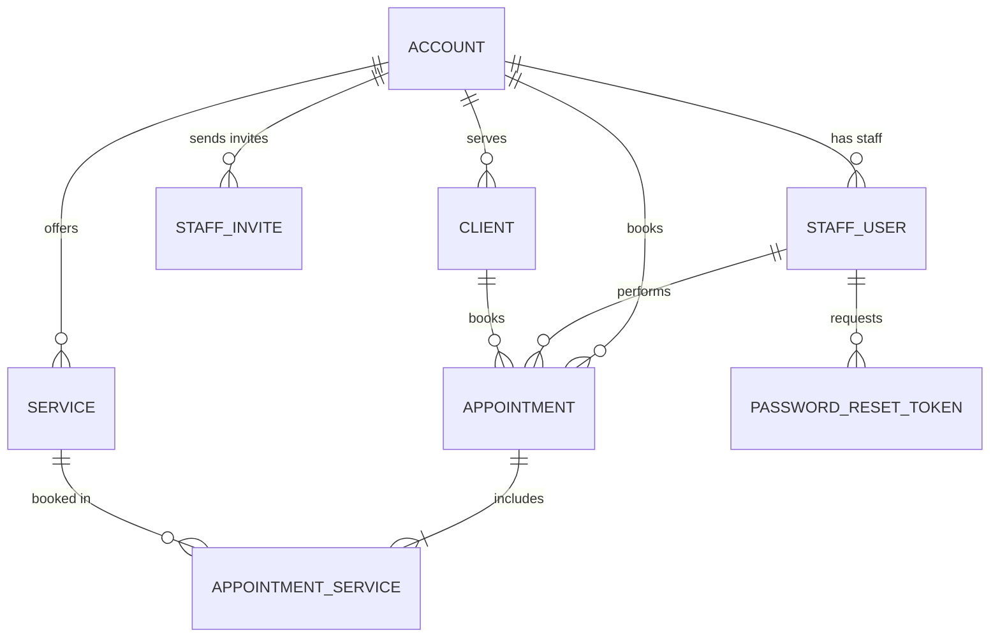

# W03 Team: Project & Code Review Report — GlowBook

Week 03 deliverables: team meeting summary, project setup evidence, architecture and design planning, and the pull-request code review.

---

## 1. Team Meeting Summary

**Synchronous meeting — Thursday, Sept 24, 2026 · 20:00 MDT (Microsoft Teams)**

- **Team members present:** Iván Chulde, Aaron Daniel Alfaro Barra
- **Team leader for Week 03:** Iván Chulde
- **Next team leader (Week 04):** Aaron Daniel Alfaro Barra

### Major decisions made

1. **Specification reviewed and confirmed.** We walked through [`docs/glowbook-spec.md`](https://github.com/adab-code/glowbook/blob/main/docs/glowbook-spec.md) story by story. Scope stayed at five user stories: account access, service catalog, client profiles, appointment calendar, daily dashboard. We added the two sections the Week 02 draft was missing — **Technical Requirements** and **Assumptions** — and explicitly pushed payments, client-facing self-booking, reminders, recurring appointments, and a month calendar view into a **Phase 2 backlog**. No functional requirement was cut.
2. **Database: PostgreSQL on Supabase, accessed with Prisma.** Chosen over MongoDB because the domain is relational (an appointment must always resolve to a real client, service, and studio) and Supabase is explicitly approved by the course. We use the pooled connection string at runtime and the direct one for migrations so Vercel's serverless functions do not exhaust connections.
3. **Authentication: Auth.js v5 with the Credentials provider.** We considered Clerk and chose Auth.js because GlowBook needs studio tenancy and staff invites — identity has to live in *our* `Account` / `StaffUser` tables so we can enforce the isolation rules ourselves. Duplicate-email and generic "invalid email or password" behaviour is enforced in `authorize()`.
4. **Component architecture agreed** (recorded in [`docs/architecture.md`](https://github.com/adab-code/glowbook/blob/main/docs/architecture.md)). Two route groups — `(auth)` for public pages and `(app)` for the authenticated shell — plus a `proxy.ts` guard. Data flows one way: route handler → Prisma → server component → client component state, with no client-side fetching library. Roughly 40 components across layout, shared, feature, and UI layers; no feature folder may import from another feature folder.
5. **Design and branding agreed** (recorded in [`docs/design-system.md`](https://github.com/adab-code/glowbook/blob/main/docs/design-system.md)): a warm "Glow Rose / Studio Gold / Warm Stone" palette, **Geist Sans** for UI with **Fraunces** for display headings, a 4px spacing scale, 44px minimum touch targets, and **shadcn/ui** as the shared component library on top of Tailwind v4 tokens.
6. **Data model agreed** (recorded in [`docs/data-model.md`](https://github.com/adab-code/glowbook/blob/main/docs/data-model.md)): eight entities with money stored as integer cents, appointments carrying a `priceCentsTotal` snapshot, `Restrict` on deletes that would orphan history, and `accountId` on every tenant-scoped table.
7. **Branching workflow practised and formalised.** `main` is protected — no direct pushes. Branch names are `feat/<slug>`, `fix/<slug>`, `docs/<slug>`. Every change lands through a pull request with at least one approving review from the other member and a 24-hour turnaround expectation. We ran the full loop live in the meeting: branch → commit → push → PR → review → merge.
8. **Board updated.** The project board now carries the issues split into frontend, backend, and infrastructure work, each 4–8 hours with a single owner, and the highest-priority P1 issues are attached to a **Week 04 milestone**.
9. **Async cadence agreed:** a short progress-and-blockers message in Teams by 5:00pm MDT each working day, blockers flagged immediately rather than at the next meeting, and the board updated before end of day so it stays a living tool.
10. **AI instructions drafted.** We captured the stack, architecture, data, styling, and workflow rules in [`.github/copilot-instructions.md`](https://github.com/adab-code/glowbook/blob/main/.github/copilot-instructions.md) so every AI assistant suggests code that fits this project. We will test and refine it as a Week 04 deliverable.
11. **Local environments verified.** Both members cloned the repository, ran `npm install`, and confirmed `npm run dev` serving the app on `localhost:3000` before any architecture work began.

### Responsibilities assigned

| Team member | Week 03 responsibility | Week 04 ownership (Week 04 milestone) |
|---|---|---|
| **Iván Chulde** (Week 03 lead) | Facilitated the meeting, captured decisions, kept the board current, drafted the design system and component architecture | Design tokens + shadcn/ui setup, `AppShell` layout, service catalog CRUD, client profiles CRUD, dashboard and calendar UI |
| **Aaron Daniel Alfaro Barra** | Ran the branching/merge practice, drafted the data model and AI instructions, verified both local environments | Prisma schema + migrations + seed, Auth.js credentials flow, session and `proxy.ts` guard, staff invitations, appointment API and overlap detection |

Shared: the appointment booking flow (FR-017 → FR-024) is co-owned — the API and validation by Aaron, the calendar UI by Iván — and is the first deliberately paired piece of work.

---

## 2. Project Setup

- **Team public GitHub repository:** https://github.com/adab-code/glowbook
  The [`README.md`](https://github.com/adab-code/glowbook/blob/main/README.md) lists both team members (Iván Chulde and Aaron Daniel Alfaro Barra) with their focus areas, plus the feature list, tech stack, local setup steps, Vercel deployment steps, environment-variable table, project structure, and the full API endpoint documentation.

- **Local development screenshot:**
  
  ‹‹PASTE SCREENSHOT HERE WHEN PUSHED TO THE REPO — Canvas is a text box, so insert the image directly into the Canvas entry as well.››
  What the screenshot shows: the `glowbook` repository cloned in VS Code, the terminal running `npm run dev` with the Next.js ready banner on port 3000, and the browser at `http://localhost:3000` rendering the app.

- **GitHub Project Board (with issues and the Week 04 milestone):** https://github.com/users/adab-code/projects/2

  | # | Issue | Area | Label | Milestone |
  |---|---|---|---|---|
  | 1 | Scaffold Next.js project with App Router, TypeScript and Tailwind | Setup | frontend | — |
  | 3 | Design database schema and seed data: Account, StaffUser, Client, Service, Appointment | Data | backend | **Week 04** |
  | 2 | Implement authentication: sign up, sign in, sign out, password reset | Auth | backend | **Week 04** |
  | 4 | Service catalog CRUD with validation and delete confirmation | Feature | backend | **Week 04** |
  | 5 | Client profiles CRUD with notes and appointment history | Feature | backend | **Week 04** |
  | 6 | Appointment calendar: create, view, edit, cancel and overlap warning | Feature | backend | — |
  | 7 | Daily dashboard with today's and upcoming appointments | Feature | frontend | — |
  | 8 | Deploy application to Vercel with environment variables configured | Infra | infra | — |

  Eight issues, each scoped to 4–8 hours with a single primary owner, split into frontend, backend, and infrastructure work. The five P1 issues above are attached to the **Week 04** milestone; the remaining three are deliberately left out of the milestone as later sprint work.

- **Supporting planning documents added this week** (all in the repository):
  - Component architecture: [`docs/architecture.md`](https://github.com/adab-code/glowbook/blob/main/docs/architecture.md)
  - Data model: [`docs/data-model.md`](https://github.com/adab-code/glowbook/blob/main/docs/data-model.md)
  - Design system: [`docs/design-system.md`](https://github.com/adab-code/glowbook/blob/main/docs/design-system.md)
  - AI assistant instructions: [`.github/copilot-instructions.md`](https://github.com/adab-code/glowbook/blob/main/.github/copilot-instructions.md)

---

## 3. Architecture & Design Planning

### 3.1 Data model

Full field-level specification: [`docs/data-model.md`](https://github.com/adab-code/glowbook/blob/main/docs/data-model.md). Summary of core entities, key fields, and relationships:

| Entity | Key fields | Relationships |
|---|---|---|
| **Account** (studio — tenancy root) | `id`, `studioName`, `slug` (unique), `timezone`, `currency`, `onboardingComplete` | Owns all staff, clients, services, and appointments (1:N to each) |
| **StaffUser** | `id`, `accountId`, `email` (unique), `passwordHash`, `role` (`OWNER`/`STAFF`), `firstName`, `lastName`, `isActive`, `lastLoginAt` | Belongs to one Account (1:N); performs many Appointments (1:N) |
| **StaffInvite** | `id`, `accountId`, `email`, `role`, `token` (hashed, 7-day expiry), `expiresAt`, `acceptedAt` | Sent by an Account (1:N); accepted into a StaffUser |
| **Client** | `id`, `accountId`, `firstName`, `lastName`, `email`, `phone`, `notes` (allergies/preferences), `isArchived` | Belongs to an Account (1:N); books many Appointments (1:N) |
| **Service** | `id`, `accountId`, `name`, `description`, `priceCents`, `durationMinutes`, `isActive` | Belongs to an Account (1:N); appears on many Appointments (N:M via the join table) |
| **Appointment** | `id`, `accountId`, `clientId`, `staffUserId`, `startsAt`, `endsAt`, `status` (`SCHEDULED`/`COMPLETED`/`CANCELLED`/`NO_SHOW`), `cancellationReason`, `priceCentsTotal` | Belongs to a Client (1:N) and optionally a StaffUser (1:N); has many AppointmentService rows (1:N) |
| **AppointmentService** (join) | `appointmentId` + `serviceId` (composite PK) | Resolves the Appointment ↔ Service many-to-many |
| **PasswordResetToken** | `id`, `staffUserId`, `tokenHash` (unique), `expiresAt` (1 hour), `usedAt` | Belongs to a StaffUser (1:N) |

**Relationship decisions the team made:**

- **`Account` is the isolation boundary.** Every tenant-scoped table carries `accountId`, and every query takes it from the session — never from user input. A record belonging to another studio returns `404`, not `403`, so IDs cannot be probed.
- **Appointment ↔ Service is many-to-many** through `AppointmentService` with a composite primary key, so one booking can cover several services (for example a lash fill plus a brow tint) and duplicate selections are impossible.
- **`Appointment.endsAt` is derived** from the selected services' `durationMinutes`, and **`priceCentsTotal` is a snapshot** taken at booking time, so editing a service price later never rewrites appointment history.
- **Delete policy:** deleting a studio cascades. Deleting a client or service that is referenced by appointments is `Restrict` and returns `409` so the UI can warn and ask for confirmation. Removing a staff member `SetNull`s their appointments, which become unassigned rather than vanishing.
- **Money is integer cents** and **timestamps are `timestamptz`** so calendar range queries and overlap checks are correct across timezones.
- **Indexes** on `StaffUser.email` (unique), `Client(accountId, lastName)`, `Service(accountId, isActive)`, `Appointment(accountId, startsAt)`, `Appointment(staffUserId, startsAt, endsAt)`, and `Appointment(clientId, startsAt)`.

### 3.2 Design planning

Full specification with token values: [`docs/design-system.md`](https://github.com/adab-code/glowbook/blob/main/docs/design-system.md).

**Brand direction:** *calm, warm, precise* — a tool that removes anxiety about double bookings, aimed at solo professionals working from a phone between appointments. Tagline: "Your studio, beautifully organised."

**Colour palette** — defined once as Tailwind v4 `@theme` tokens in `src/app/globals.css` and consumed everywhere as `brand-*`, `accent-*`, `neutral-*`, plus semantic status pairs:

| Role | Scale |
|---|---|
| **Brand — Glow Rose** (primary actions, active nav, focus rings) | `50 #FDF2F7` · `100 #FAE6EF` · `200 #F4C9DC` · `300 #EBA3C1` · `400 #DE74A1` · `500 #CE4C81` · **`600 #B4346A` (primary button, links — 5.84:1 on white)** · `700 #932A57` (hover) · `800 #762449` · `900 #5F213D` |
| **Accent — Studio Gold** (highlights, "now" marker) | `100 #FAEECF` · `300 #EAC062` · `500 #C9861F` · `700 #855115` |
| **Neutral — Warm Stone** (surfaces, text, borders) | `50 #FAF8F7` · `100 #F3EFEE` · `200 #E6DEDA` (borders) · `300 #D2C7C2` · `400 #A99C97` · `500 #857874` · `600 #6B605C` (secondary text, 6.1:1) · `700 #574E4B` · `800 #3B3533` · `900 #221E1D` · `950 #14100F` (page background) |
| **Semantic** | success `#2F7D57` / `#E8F5EE` · warning `#B45309` / `#FDF3E3` · danger `#C0342B` / `#FBEBEA` · info `#2F6F8F` / `#E9F2F7` |
| **Appointment status mapping** | Scheduled → info · Completed → success · Cancelled → danger · No-show → warning. Always rendered with a text label, never colour alone |

**Typography**

| Role | Family | Treatment |
|---|---|---|
| Body / UI | **Geist Sans** (`next/font`) | Variable weight; `body` 16/24, `body-sm` 14/20, `label` 13/16 |
| Display / page titles | **Fraunces** (`next/font`, variable) | `h1` `clamp(1.75rem, 3vw, 2rem)`/1.2 at weight 600; `display` `clamp(2.5rem, 6vw, 3.5rem)` for the landing hero only |
| Times and prices | Geist Sans with `tabular-nums` | Keeps calendar slots and prices from shifting as digits change |

**Layout and spacing conventions**

- **4px base scale** using Tailwind's default steps, applied semantically: page gutter `px-4 sm:px-6 lg:px-8` · `space-y-4` between form fields · `gap-6` between cards · `space-y-8` between page sections · `p-4 sm:p-6` card padding · `gap-2` between an icon and its label · `gap-1 p-2` inside dense calendar blocks.
- **App shell:** CSS grid — fixed `w-64` sidebar at `lg` and above, sticky `h-16` topbar, independently scrolling content, content capped at `max-w-7xl`.
- **Mobile-first.** Below `lg` the sidebar becomes a shadcn `Sheet` from a hamburger in the topbar. `DataTable` falls back to stacked cards on small screens so nothing ever scrolls horizontally. 375px is the primary design target.
- **Radii and elevation:** `0.5rem` controls, `1rem` cards, `rounded-full` badges; `shadow-xs` at rest → `shadow-sm` on hover → `shadow-md` for popovers and dialogs.
- **Motion:** 150ms hover, 200ms panels, 300ms page fades, all `ease-out` and wrapped in `motion-reduce` variants.
- **Shared UI library:** shadcn/ui (Button, Input, Label, Textarea, Select, Dialog, AlertDialog, DropdownMenu, Table, Badge, Card, Calendar, Popover, Skeleton, Toast) with CSS variables mapped onto our scales, plus a `components.json` so both members install identical primitives.

**Component architecture summary:** two route groups (`(auth)`, `(app)`) plus `src/proxy.ts` for auth interception; 5 layout components, 8 shared components, ~19 feature components across `auth`/`dashboard`/`calendar`/`clients`/`services`/`staff`, and 14 UI primitives — comfortably over the "at least 5 components used across multiple pages" requirement. A full component hierarchy diagram and the Week 04 priority ranking are in [`docs/architecture.md`](https://github.com/adab-code/glowbook/blob/main/docs/architecture.md).

---

## 4. W03 Team: Code Review Report

**Pull Request reviewed:** https://github.com/ivanchulde/sacrament-meetings/pull/1

- **Repository (assigned teammate's):** https://github.com/ivanchulde/sacrament-meetings
- **Pull Request URL:** https://github.com/ivanchulde/sacrament-meetings/pull/1
- **PR title:** Complete Sacrament Meeting Planner
- **Branch:** `peer-code-review` → `main` · 4 commits · 19 files changed · +846 / −97
- **Preview deployment:** Vercel deployed the branch successfully; all checks passed, no conflicts with the base branch

### Review comment submitted on the pull request

> Overall, the implementation meets the main requirements of the checklist. The TypeScript data model is properly defined, there are five complete meeting records, and no `any` type is used in the modified files. The reusable components are present, and `MeetingDetail` displays the required meeting information. The routing, layouts, API routes, and typed data fetching are also implemented correctly.
>
> One area I would recommend checking is the cleanup of the original Next.js template code. The diff shows some old imports and template content in `app/layout.tsx` and `app/page.tsx`. If any of that code remains in the final files, it should be removed to avoid unused imports and unnecessary code. Other than that, the implementation follows the checklist well.

**What I checked:** the TypeScript data model and whether the five meeting records are complete, that no `any` type slipped into the modified files, that the reusable components are actually shared across pages, that `MeetingDetail` renders every required field, and that routing, layouts, the API routes, and typed data fetching are all correctly implemented.

**The one actionable finding:** leftover `create-next-app` template code in `app/layout.tsx` and `app/page.tsx` — old imports and boilerplate markup that should be removed so the final files carry no unused imports.

### Vercel deployment review notes

Tested the Vercel preview deployment of the same branch on **PC / Chrome**. No issues were found on any route:

- `/api/meetings` — no problems were found.
- `/api/meetings/1` — no problems were found.
- `/meetings` — no problems were found.
- `/meetings/1` — no problems were found.
- `/meetings/current` — no problems were found.
- `/meetings` layout — no problems were found.
